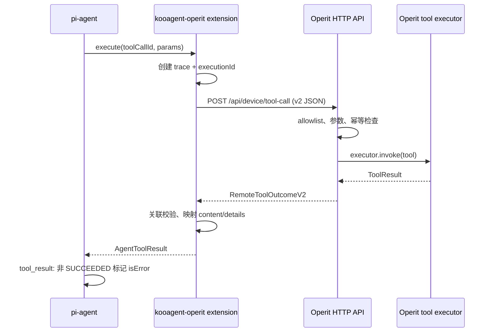

# Operit Remote Tool API v2：当前实现说明

本文记录当前已实现且已在 Android 真机上验证的 Remote Tool API v2。它是 pi-agent 与 Operit Android 运行态之间的工具执行边界，不修改 pi-agent 源码。

## 1. 范围与职责

当前远程 allowlist 固定为 27 个原子工具，不包含 `run_ui_subagent`。工具选择、Agent 编排、错误恢复和重试策略由 pi-agent 与 `kooagent-operit` extension 负责；Operit 仅负责校验、执行和返回结构化结果。

| 层 | 职责 |
| --- | --- |
| pi-agent | 选择工具、按 `executionMode` 调度、把工具结果写为 `ToolResultMessage`。 |
| `kooagent-operit` extension | 注册 27 个本地工具，创建 trace，调用 HTTP API，校验响应关联关系，映射 `content/details`，实施有限传输重试。 |
| Operit HTTP | 鉴权、解析协议 v2、校验 allowlist/参数、根据 `executionId` 去重、直接调用工具 executor、维护短期执行状态。 |
| Operit executor | 执行 Android、文件、网页或记忆工具并产生 `ToolResult`。 |

Operit 的远程入口不会调用 `AIToolHandler.executeTool()`，因此不会进入 Operit 内部 Agent hook、Agent 调度或自动 package 调度。



## 2. HTTP 端点与鉴权

所有设备端点都要求现有 Bearer Token：`Authorization: Bearer <OPERIT_TOKEN>`。

| 方法 | 路径 | 用途 |
| --- | --- | --- |
| `GET` | `/api/device/health` | 检查 Android 运行态和协议版本。 |
| `GET` | `/api/device/tools` | 返回实际已注册工具与远程 allowlist。 |
| `POST` | `/api/device/tool-call` | 执行一次 v2 工具调用。 |
| `GET` | `/api/device/tool-executions/{executionId}` | 查询运行中或已完成执行。 |
| `DELETE` | `/api/device/tool-executions/{executionId}` | 请求取消执行。 |

协议不接受 v1 的 `requestId`、`Map<String, String>` 参数表、`resultText` 或 `resultJson` 字段。

## 3. 工具范围与执行策略

本地工具名以 `android_` 为前缀，远程名称为下表的 `remoteName`。具体参数定义是 Extension 中的 TypeBox schema；该 schema 会在 pi-agent 侧先校验必填项和参数类型。

| remoteName | 本地工具名 | 策略 |
| --- | --- | --- |
| `list_installed_apps` | `android_list_installed_apps` | 并行、安全读 |
| `start_app` | `android_start_app` | 串行、不安全写 |
| `capture_screenshot` | `android_capture_screenshot` | 串行、安全读（读取设备状态） |
| `get_page_info` | `android_get_page_info` | 串行、安全读（读取设备状态） |
| `tap`, `long_press`, `swipe`, `click_element`, `set_input_text`, `press_key` | 对应 `android_*` | 串行、不安全写 |
| `sleep` | `android_sleep` | 串行、安全读（读取设备状态） |
| `use_package` | `android_use_package` | 串行、带幂等键的写 |
| `list_files`, `read_file`, `read_file_part`, `find_files`, `grep_code`, `grep_context` | 对应 `android_*` | 并行、安全读 |
| `apply_file`, `create_file`, `edit_file`, `make_directory` | 对应 `android_*` | 串行、带幂等键的写 |
| `delete_file` | `android_delete_file` | 串行、不安全写 |
| `visit_web` | `android_visit_web` | 并行、外部安全读 |
| `download_file` | `android_download_file` | 串行、带幂等键的外部写 |
| `query_memory`, `get_memory_by_title` | 对应 `android_*` | 并行、安全读 |

`run_ui_subagent` 被明确排除：UI 子 Agent 编排只能在 pi-agent 一侧发生。

## 4. 工具调用请求

### 4.1 请求体

`POST /api/device/tool-call` 的 body 必须是如下 JSON：

```ts
type JsonValue = boolean | number | string | null | JsonValue[] | { [key: string]: JsonValue };

interface RemoteToolRequestV2 {
  protocolVersion: 2;
  trace: {
    sessionId: string;
    runId: string;
    turnIndex: number;
    traceId: string;
    toolCallId: string;
    executionId: string;
    attempt: number;
  };
  toolName: string;
  arguments: Record<string, JsonValue>;
  timeoutMs: number;
}
```

字段含义：

| 字段 | 发送方 | 说明 |
| --- | --- | --- |
| `protocolVersion` | Extension | 必须为数字 `2`；缺失或非 v2 会被拒绝。 |
| `trace.sessionId` | Extension | Pi 会话 ID。 |
| `trace.runId` | Extension | 一次 agent run 的 ID。 |
| `trace.turnIndex` | Extension | 当前 agent turn 序号。 |
| `trace.traceId` | Extension | 跨端 trace ID。 |
| `trace.toolCallId` | Pi/Extension | Pi 的单次 tool call ID。 |
| `trace.executionId` | Extension | UUID；幂等键、状态查询键和取消键。 |
| `trace.attempt` | Extension | 逻辑执行尝试序号；同一传输重发保持同一请求。 |
| `toolName` | Extension | 27 项 allowlist 中的远程工具名。 |
| `arguments` | Extension | 保持 JSON 类型的工具参数对象。 |
| `timeoutMs` | Extension | 正整数，Operit executor 的最大执行时长。 |

Operit 在调用既有 `AITool` executor 前，会将字符串参数保留为字符串；布尔、数字、数组、对象会 JSON 序列化为 executor 现有的字符串参数表示。协议本身不会丢失原始 JSON 类型。

### 4.2 请求示例

```json
{
  "protocolVersion": 2,
  "trace": {
    "sessionId": "session-1",
    "runId": "run-1",
    "turnIndex": 3,
    "traceId": "b3a0d9b7d3c64c3e",
    "toolCallId": "call-7",
    "executionId": "018f0000-0000-7000-8000-000000000001",
    "attempt": 1
  },
  "toolName": "sleep",
  "arguments": {
    "duration_ms": 1000
  },
  "timeoutMs": 15000
}
```

## 5. 工具结果

### 5.1 统一 outcome

无论成功、业务失败、拒绝、超时或取消，已进入执行流程的响应都使用同一 outcome 形状：

```ts
interface RemoteToolOutcomeV2 {
  protocolVersion: 2;
  trace: RemoteToolRequestV2["trace"];
  toolName: string;
  status: "SUCCEEDED" | "FAILED" | "REJECTED" | "TIMED_OUT" | "CANCELLED" | "UNAVAILABLE";
  content: Array<
    | { type: "text"; text: string }
    | { type: "image"; data: string; mimeType: string }
    | { type: "artifact"; artifactId: string; mimeType: string; size: number; sha256: string }
  >;
  data?: JsonValue;
  error?: {
    code: string;
    category: "INVALID_REQUEST" | "PERMISSION" | "NOT_FOUND" | "PRECONDITION" |
      "CONFLICT" | "TIMEOUT" | "CANCELLED" | "UNAVAILABLE" | "EXECUTION" | "INTERNAL";
    message: string;
    retryable: boolean;
    userActionRequired: boolean;
    data?: JsonValue;
  } | null;
  timing: {
    acceptedAtMs: number;
    startedAtMs: number;
    finishedAtMs: number;
    durationMs: number;
  };
  runtime?: {
    runtimeId: string;
    deviceRuntime: "android";
    appVersion: string;
  };
}
```

`error: null` 是成功结果的合法值，Extension 已显式兼容这一 Kotlin 序列化形式。

### 5.2 字段使用约定

| 字段 | 用途 |
| --- | --- |
| `content` | 给模型看的内容；文本直接传给 Pi。当前 27 个 executor 主要产生 text。image 和 artifact 已在协议/映射层支持，artifact 会先转换成可读文本引用。 |
| `data` | executor 的结构化结果，供 UI、日志和诊断使用，不应让模型依赖其内部 Kotlin 类型名。 |
| `error` | 机器可读的失败信息；模型可读摘要仍放在 `content`。 |
| `timing` | 服务端接受、开始、结束和耗时，单位为毫秒。 |
| `runtime` | 返回 Android 运行态标识及 APK 版本。 |

成功示例：

```json
{
  "protocolVersion": 2,
  "trace": { "sessionId": "...", "runId": "...", "turnIndex": 3, "traceId": "...", "toolCallId": "...", "executionId": "...", "attempt": 1 },
  "toolName": "sleep",
  "status": "SUCCEEDED",
  "content": [{ "type": "text", "text": "Slept for 1000ms" }],
  "data": { "__type": "com.ai.assistance.operit.core.tools.SleepResultData", "requestedMs": 1000, "sleptMs": 1000 },
  "error": null,
  "timing": { "acceptedAtMs": 0, "startedAtMs": 0, "finishedAtMs": 1000, "durationMs": 1000 },
  "runtime": { "runtimeId": "operit-android", "deviceRuntime": "android", "appVersion": "1.11.0+5" }
}
```

失败示例（不存在 package）：

```json
{
  "toolName": "use_package",
  "status": "FAILED",
  "content": [{ "type": "text", "text": "[PACKAGE_ACTIVATION_FAILED] Package not found: demo" }],
  "error": {
    "code": "PACKAGE_ACTIVATION_FAILED",
    "category": "PRECONDITION",
    "retryable": false,
    "userActionRequired": true
  }
}
```

### 5.3 HTTP 与业务错误

- 协议无法解析、缺字段或版本不对：HTTP `400` + `RemoteProtocolErrorResponse`。
- 工具不在 allowlist：HTTP `403` + `status: "REJECTED"` outcome。
- 同一 `executionId` 对应不同请求：HTTP `409` + `EXECUTION_ID_CONFLICT` outcome。
- executor 业务失败：通常 HTTP `200`，但 outcome 为 `FAILED` 或 `REJECTED`。

Extension 不以 HTTP 文本判断业务结果：它优先解析并校验 v2 outcome；无法解析时才归一化为本地 `FAILED` 或 `UNAVAILABLE` outcome。

## 6. Pi 结果映射

Extension 把 outcome 转换为 Pi 的 `AgentToolResult`：

```ts
{
  content: outcome.content,
  details: {
    kind: "operit-tool-result",
    schemaVersion: 2,
    outcome
  }
}
```

成功时，模型可见 `content` 保持 Operit 原始内容。失败时，Extension 会在原始内容前增加一个紧凑错误投影：

```text
[OPERIT_TOOL_ERROR]
status=FAILED
code=PACKAGE_ACTIVATION_FAILED
category=PRECONDITION
retryable=false
userActionRequired=true
message="Package not found: demo"
```

该投影只包含 LLM 做恢复决策需要的字段；message 最多保留 1,024 个字符。若非成功 outcome 异常地缺少结构化 error，Extension 会使用 `REMOTE_ERROR_UNSPECIFIED / INTERNAL / retryable=false / userActionRequired=false` 的保守值。完整 trace、timing、runtime、error data 和结构化结果仍只保存在 `details`（已有的超大 data 会话截断规则保持不变）。远端原始 `content` 会继续保留在摘要之后，以免丢失失败前已经产生的部分输出。

随后 `tool_result` hook 对 Operit result 设置：

```ts
isError = outcome.status !== "SUCCEEDED";
```

这使 Pi 的消息层最终得到原有的 `ToolResultMessage`，同时保留结构化 outcome 供 UI、trace 和后续诊断。为避免会话详情过大，`data` 的 JSON 编码超过 32,768 字符时会从 `details.outcome` 移除，并记录 `omittedData.encodedChars`；模型可见的 `content` 不变。

## 7. 幂等、状态和取消

### 7.1 幂等

Operit 的短期执行注册表以 `executionId` 为键：

1. 首次请求成为 owner 并执行。
2. 相同 `executionId` 且整个请求完全相同，复用同一执行；若已完成，直接返回原 outcome。
3. 相同 `executionId` 但请求不同，返回 `409 EXECUTION_ID_CONFLICT`，不会执行第二次。

注册表最多保留 512 个已完成执行；达到上限时按最早结束时间清理。

### 7.2 查询与取消

`GET /api/device/tool-executions/{executionId}` 的状态为：

- `RUNNING`：executor 仍在运行。
- `CANCELLATION_REQUESTED`：已请求取消，尚未产生最终 outcome。
- 最终状态：`SUCCEEDED`、`FAILED`、`REJECTED`、`TIMED_OUT` 或 `CANCELLED`，并带 `outcome`。

`DELETE` 是请求式取消：Operit 标记取消并中断执行线程。executor 若响应中断，最终结果为 `CANCELLED`；不能保证每个底层操作都立即停止。

## 8. 超时与重试

Operit 使用请求的 `timeoutMs` 包裹 executor。超时返回 `TIMED_OUT / EXECUTION_TIMEOUT`。

Extension 发生客户端超时时，先查询对应的 execution state，避免对副作用工具盲目重发。若传输层产生可重试的 `UNAVAILABLE`，才可能自动重试，且同时满足：

1. `error.retryable === true`；
2. 策略不是 `unsafe`；
3. 该工具策略最多允许第二次传输尝试；
4. 当前 agent run 仍有全局重试预算（初始为 3）。

`AbortSignal` 触发时，Extension 会向相同 `executionId` 发送 DELETE 取消请求。

## 9. Trace 与日志

Extension 为每个 agent run 生成 `runId` 和 `traceId`，每次调用生成 `executionId`。返回时会严格校验以下字段与请求一致：`toolName`、`sessionId`、`runId`、`turnIndex`、`traceId`、`toolCallId`、`executionId`、`attempt`；不一致的响应会被降级为 `PROTOCOL_CORRELATION_MISMATCH`。

如设置 `OPERIT_TRACE_FILE`，Extension 会追加 JSONL 完成事件，仅包含关联 ID、工具名、状态、错误码、耗时与传输尝试次数；不会写入请求参数、完整结果或图片数据。

## 10. 真机验证记录（2026-07-20）

已通过 ADB 端口转发对安装了当前 APK 的设备验证：

- health 返回 v2；
- tools/allowlist 均为 27 项；
- `list_installed_apps` 返回成功的完整 outcome；
- 旧请求被拒绝，`run_ui_subagent` 被拒绝；
- `sleep` 的运行中查询、取消、最终 `CANCELLED` 均正常；
- 完全相同的 executionId 重放复用完成结果，不同请求复用 ID 返回冲突；
- 不存在的 `use_package` 返回 `FAILED / PACKAGE_ACTIVATION_FAILED`；
- Extension client 到真机的 `sleep` 调用正确映射为 Pi `content/details`。

对应的快速调试示例见 [remote_tool_corecoder_debug.md](remote_tool_corecoder_debug.md)。
